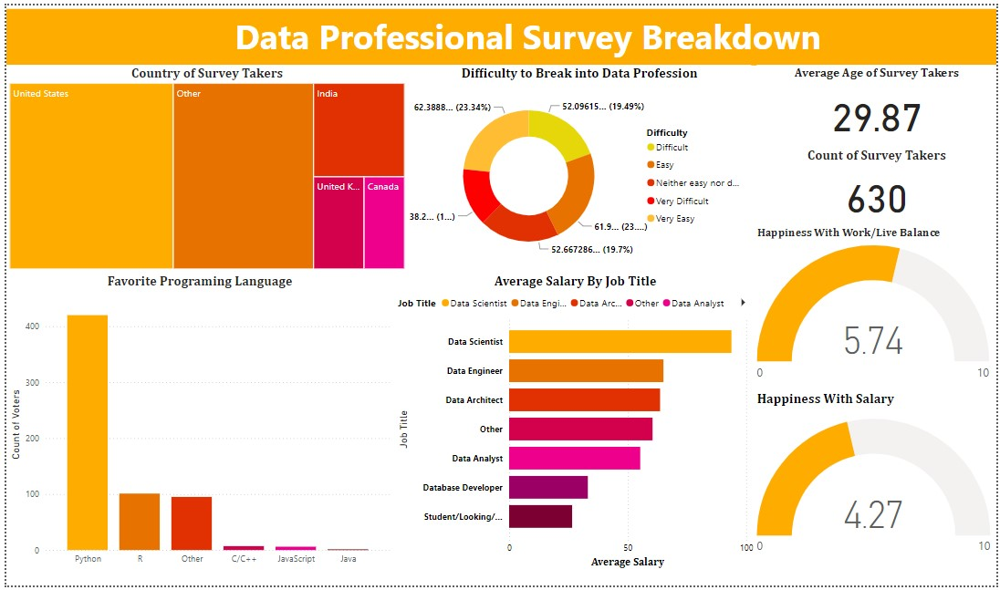

# Data-Professionals
A closer look on how data professionals are thriving paying close attention to the challenges that hinder there growth and development.

## Table of Content

Introduction

Problem statement

Project Aims

Project Significance

Data Source

Tool Used

Data Transformation and Loading

Data Analysis and Visualization

Insights 

Recommendation

Conlusion
- - -

## Introduction
 This project provides comprehensive insight of the data professionals. 
 It covers insights on their demographics, programming languages they prefer, career paths, salary expectations, and overall job satisfaction.

## Problem statement
The data profession is facing several challenges that hinder its growth and development. 
This project seeks to look into;
How can we facilitate entry into the data profession, as many individuals struggle to break into the field?
What are the most in-demand programming languages among data professionals, and how can we ensure that aspiring professionals acquire these skills?
What are the prevailing salary trends and job titles in the data field, and how can we ensure fair compensation for data professionals?
How can we improve job satisfaction among data professionals, particularly with regards to work-life balance and salaries?
This rewritten version presents the challenges as open-ended questions, encouraging exploration and solution-finding.

## Project Aims
The aim of the project is to provide a comprehensive insight of the data professional landscape, encompassing various aspects like;
The challenges faced while entering the data profession.
The skills and technologies preferred by data professionals.
The different job titles and salary ranges in the industry.
The level of job satisfaction among data professionals.

## Project Significance
This dashboard offers valuable insights for:
Aspiring data professionals: By understanding the challenges and skillsets required, individuals can better prepare for a career in data.
Hiring managers: The data reveals the most sought-after skills and salary expectations, informing recruitment and talent acquisition strategies.
Industry stakeholders: The dashboard provides a data-driven perspective on the trends and challenges within the data professional ecosystem.

## Data Sources 
Kaggle.com

## Tools Used 
- **Microsoft Power BI** [Download here](https://www.microsoft.com/en-us/download/details.aspx?id=58494)

## Data Transformation and Cleaning

## Data Analysis and Visualization

## Insights 
-The survey focuses on the demographics of data professionals and the experience they have had breaking into the data industry.

-The visualizations show that the most popular programming language used is Python, with R and 'Other' coming in second and third. 

-The most common job titles in the data industry are Data Scientist and Data Engineer.

-The average age of a data professional is 29.87 years old. The majority of survey takers report being happy with their work-life balance. The average salary for data professionals is between $50,000 and $60,000 per year.

-It is difficult to break into the data profession, with most respondents reporting that it is either difficult or very difficult to break into the industry.
The results of the survey indicate that the data profession is a growing and competitive field.

## Recommendation

To increase the number of data professionals, it is important to make it easier for people to break into the industry. This could be done by providing more educational resources and training programs, or by creating more internship opportunities.
To attract and retain talent, it is important to offer competitive salaries and benefits. Data professionals are in high demand, so companies need to be willing to pay to attract the best talent.
The industry must be inclusive and attract a diverse range of talent.

## Conclusion 
The data industry is a growing and competitive field. There is a high demand for data professionals with the skills and knowledge needed to succeed in this industry.
It is difficult to break into the data profession, but there are opportunities available for those who are willing to work hard and develop the necessary skills.
